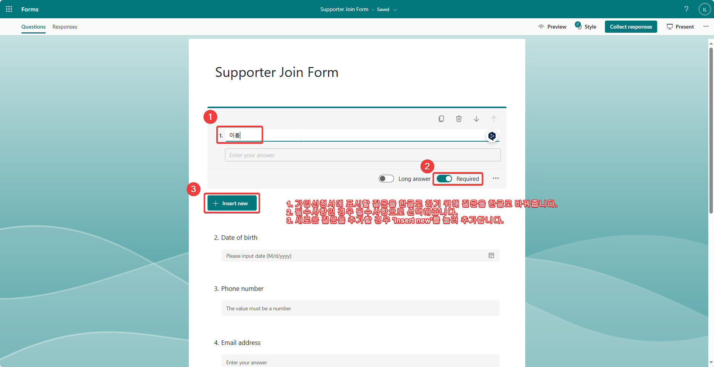
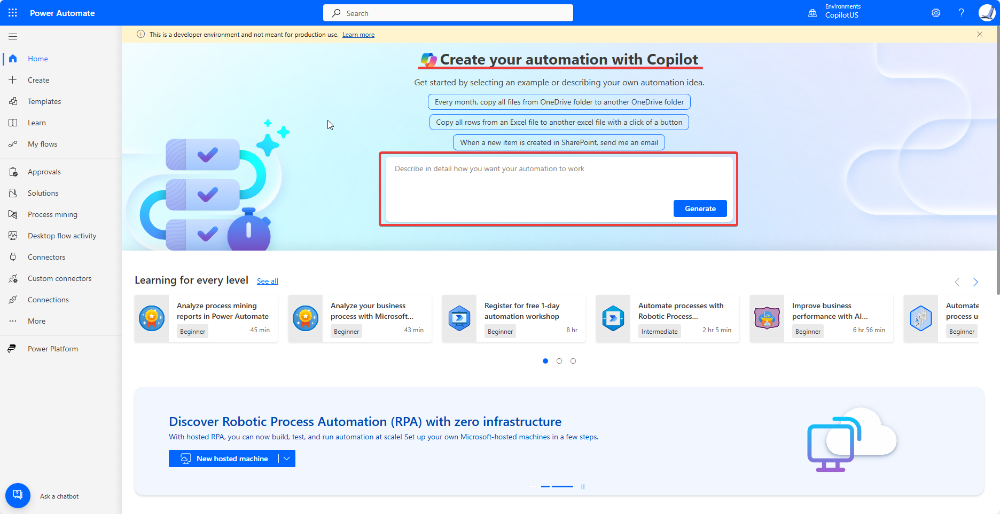
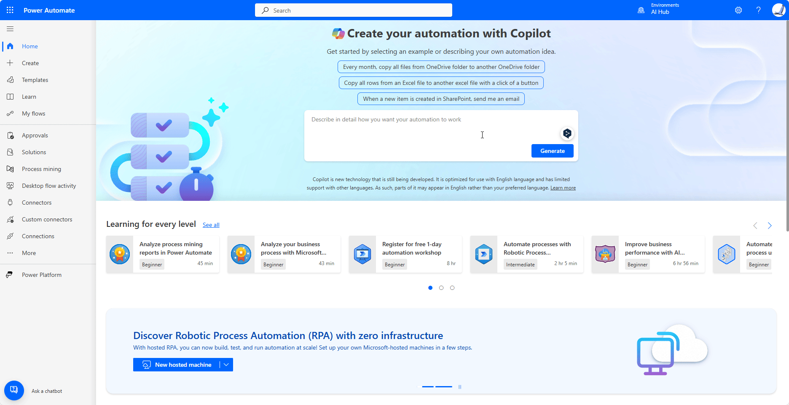
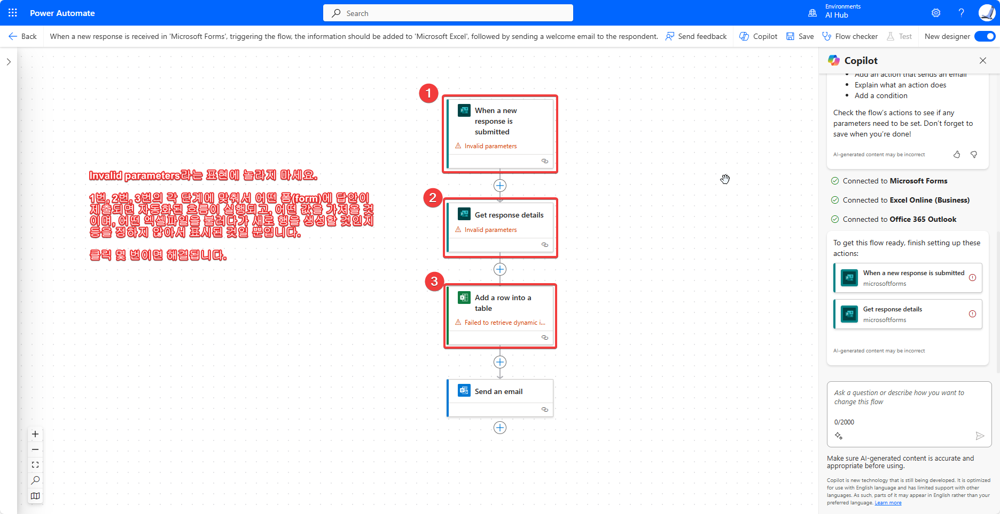

# 후원회원 관리
## 1. 후원회원 모집과 관리
### 1. 후원회원 모집
- 정치자금법상 후원회원이 될 수 있는 사람과 없는 사람이 정해져 있습니다. 
  - 후원회원이 될 수 없는 자를 회원으로 가입하게 하거나 가입한 경우에도 100만원 이하의 과태료 처분을 받게 됩니다(정치자금법 제51조)  
  - 후원회원에 대한 자세한 내용은 [지방의회의원후원회 설립 가이드북-후원회원 모집](assets/지방의회의원후원회%20설립%20가이드북_설립후_02_후원회원모집.pdf)에서 확인하실 수 있습니다.
- 후원회원이 가입할 때 요구되는 사항은 '성명, 생년월일, 주소, 직업 및 전화번호'는 반드시 수집해야 하며, 그 외의 정보는 후원회에서 임의로 추가할 수 있습니다.
### 2. 후원회원 명부
- 후원회원 명부는 반드시 비치해야 하며 허위로 작성하면 안됩니다(정치자금법 제48조). 위반시 200만원 이하의 벌금에 처하게 됩니다.
- 후원회 가입과 탈퇴시 작성할 서식과 후원회원 명부에 관한 사항은 위 '지방의회의원후원회 설립 가이드북-후원회원 모집'에서 확인하실 수 있습니다.
## 2. 후원회원 관리 자동화
### 1. 후원회원 모집시 필요한 정보 설계
앞서 말씀드린 것처럼 후원회원이 가입할 때 요구되는 사항은 '성명, 생년월일, 주소, 직업 및 전화번호'는 반드시 수집해야 합니다. 이를 위해 후원회원 모집시 필요한 정보를 설계해야 합니다.  
흔히 엑셀로 다루므로 일단 엑셀 파일을 설계하고 생성해보겠습니다. 챗지피티(ChatGPT)를 통해 아래와 같이 요구사항을 입력하고 해당 엑셀 파일을 생성할 수 있습니다.
```prompt
지방의회 의원도 정치자금법이 개정되어 후원회를 설립할 수 있습니다. 참고자료를 확인 한 다음 후원회원을 관리하기 위한 명부를 엑셀 파일로 만들어 주세요. 나중에 이 엑셀 파일을 데이터베이스로 Power Automate, Power Apps 등을 활용해 업무를 자동화 하거나 손쉽게 관리하려고 하니 '표(Table)' 형식으로 만들어 주세요. 데이터는 없어도 되지만 반드시 '표' 형식으로 만들어 줘야 합니다.
```
**작업예 01**  


**작업예 02**  
위 참고할 자료인 '지방의회의원후원회 설립 가이드북-후원회원 모집'을 프롬프트 창에 업로드한 다음, 위 프롬프트를 복사해서 붙여넣으면 챗지피티가 해당 내용을 참고하여 엑셀 파일을 생성해 줍니다.  


**작업예 03**
[Copilot in Windows 활용 엑셀파일 생성](videos/SMC_Excel_Generation.mp4)

### 2. 후원명부를 고려해서 모집 폼(Form) 만들기
위에서 생성한 엑셀 파일을 기반으로 후원회원 모집 폼을 만들어 보겠습니다. 이를 위해 'Microsoft Forms'를 활용하겠습니다.  
1. 먼저 ['Microsoft Forms'](https://forms.microsoft.com)에 접속합니다.
2. 다음과 같이 새로운 폼을 만듭니다.  

3. 그리고 폼에 맞춰 질문을 추가합니다. 제목을 영어로 만들면 인공지능이 제목을 분석해서 추천을 해주기도 합니다.

4. 추천된 질문을 선택해볼까요?

5. 추천된 질문을 선택하고 편집 또는 추가할 수 있습니다.


### 3. 후원회원 관리 자동화
위에서 만든 폼을 기반으로 'Power Automate'를 활용하여 후원회원 관리 업무를 자동화할 수 있습니다. 본 사례에서는 후원회원이 가입하면 'Microsoft Forms'를 통해 정보를 입력하고, 이 정보를 'Microsoft Excel'로 저장하고, 이어서 신청한 인원에게 가입 축하 임시 메일을 보내는 과정까지를 자동화 해보겠습니다.
1. 먼저 ['Power Automate'](https://make.powerautomate.com)에 접속합니다.  
   아래와 같이 자동화된 업무를 '프롬프트'를 통해서 생성하게 해줍니다. 아직은 브라우저 언어가 영어인 경우에 한해 기본 기능으로 지원합니다. 프롬프트는 한글로 작성하셔도 됩니다. 마이크로소프트는 '코파일럿(CoPilot)'이라는 인공지능을 활용하여 프롬프트를 분석하고 자동화 업무를 생성해 줍니다.
   
2. 아래와 같은 프롬프트를 입력하고 자동화를 만들어 보겠습니다.
    ```prompt
    후원회원이 'Microsoft Forms'를 통해 정보를 입력하면, 원드라이브의 'Microsoft Excel'에 해당 내용을 저장하고, 이어서 신청한 인원에게 가입 축하 임시 메일을 보내는 과정을 자동화 해주세요.
    ```
    혹시 위 한글이 안될 경우를 대비해서 영어로도 작성해보겠습니다.
    ```prompt
    When a new response is submitted to a form in 'Microsoft Forms' as a trigger of the flow, add the information to 'Microsoft Excel', and then send a welcome email to the applicant.
    ```    
    
3. 한글로 프롬프트를 입력하면 잘 안될때도 있어서 위에 영어로 간단히 만들었던 프롬프트를 입력한 다음 '코파일럿(Copilot)'에게 나은 표현으로 수정해달라고 한 다음 그 프롬프트를 입력하고 자동화된 업무흐름을 만들어 보았습니다.
    
4. 생성된 자동화 업무 흐름을 각 단계별로 적절한 설정을 해주면 됩니다.  
    
